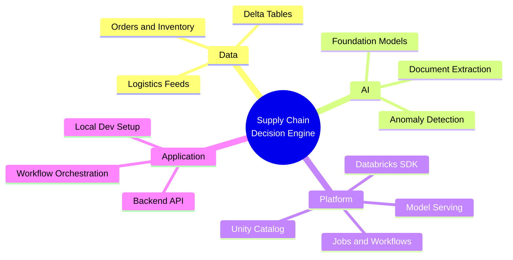
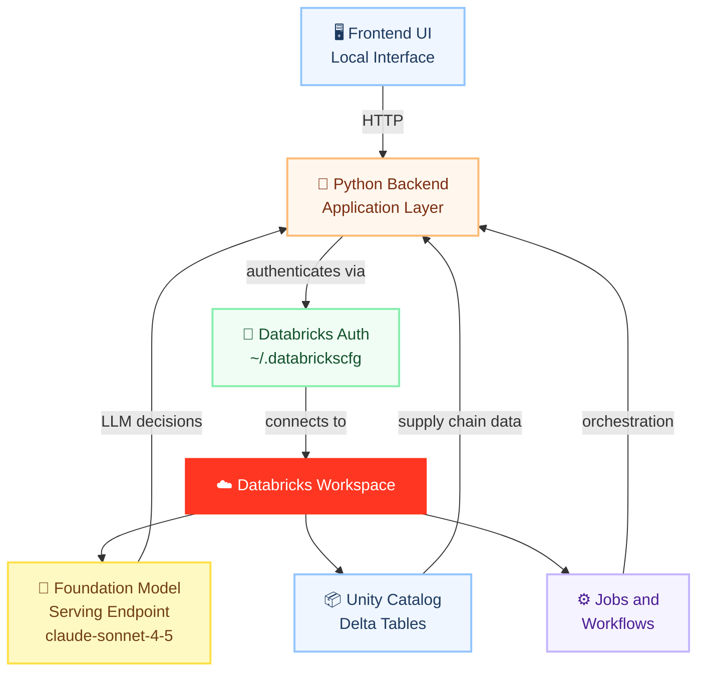
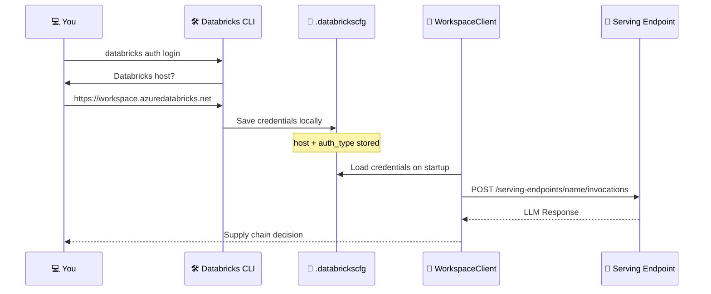
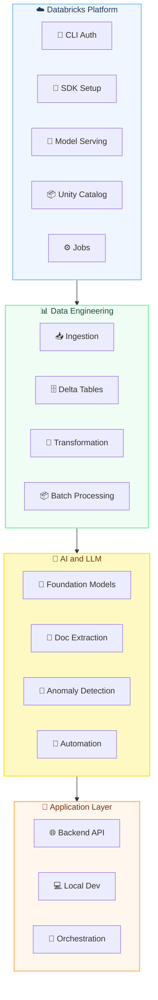
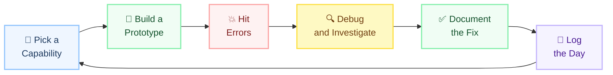
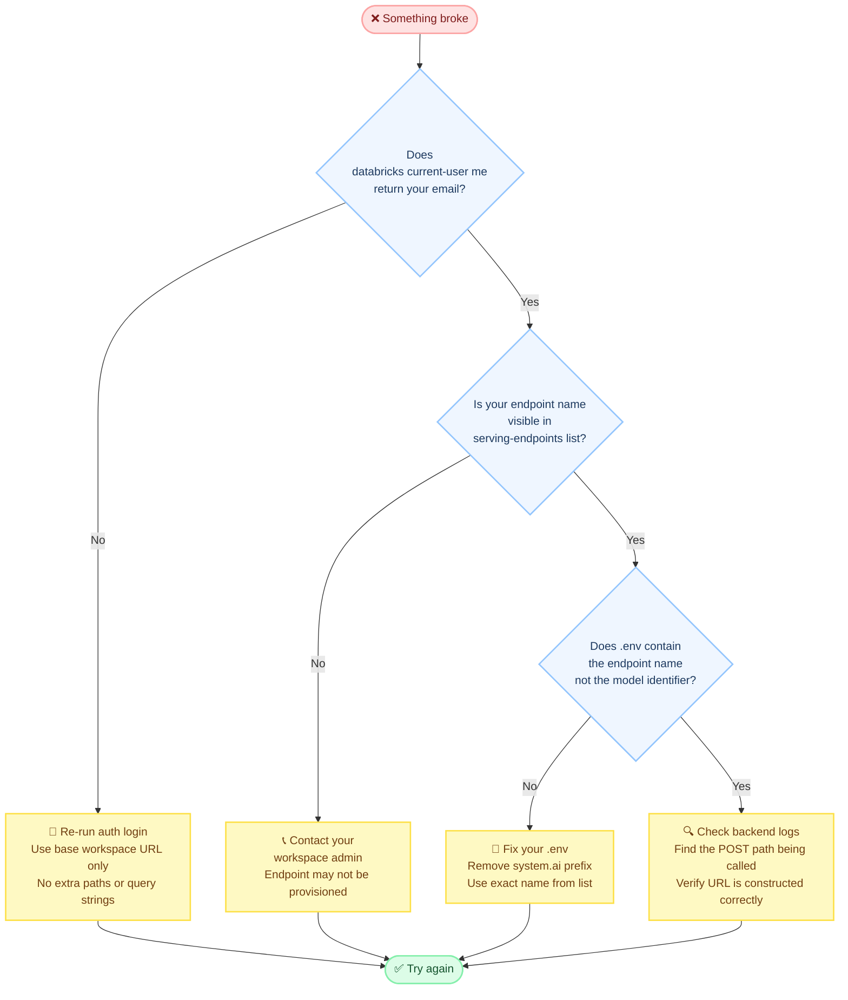

#  &nbsp;Supply Chain × Databricks

**Daily Engineering Experiments — Building Real Systems, Breaking Things, Learning Everything**


---

> *Most Databricks tutorials show clean success paths.*
> *Real projects rarely work that way.*
> **This is the real version.**

---

## 👋 Welcome

This repository is a daily hands-on engineering log.

Every day we pick one piece of Databricks, try to build something real with it, and write down exactly what happened — including the parts that broke, the confusing error messages, and the fixes that actually worked.

The goal is simple: go from a blank Databricks workspace to a fully working **AI-powered Supply Chain Decision Engine**, one experiment at a time.

If you are new to Databricks, or you are trying to build something real and hitting walls — this is for you.

---

## 🧭 What We Are Building



---

## 🏗️ System Architecture



---

## 🔐 Authentication Flow



---

## 🔬 Experiment Areas



---

## 🎯 What This Is About

| What We Do | Why It Matters |
|------------|---------------|
| 🔨 Build working prototypes daily | Learn by doing, not just reading docs |
| 💥 Record every error we hit | Real issues, not sanitised tutorials |
| 🔍 Document the debugging process | Build a practical troubleshooting guide |
| ✅ Write the working solution | Leave a clear path for others to follow |
| 📝 Log everything | Becomes a playbook for the whole team |

---

## 📅 Daily Experiment Format



---

## 🗓️ Experiment Log

<details>
<summary><b>📅 Day 1 — Local Setup and First Databricks Connection</b></summary>

<br>

**Goal:** Get the project running locally and make a successful call to a Databricks Foundation Model endpoint.

---

**What we built:**
- Project scaffold with `uv` as the environment manager
- Databricks CLI authentication configured
- First successful LLM call via the OpenAI-compatible serving endpoint

---

**Errors we hit and how we fixed them:**

| # | Error | Root Cause | Fix |
|---|-------|-----------|-----|
| 1 | `uv not recognized` | Binary not in PATH after install | Add `~/.local/bin` to system PATH |
| 2 | `databricks not recognized` | Python Scripts folder not in PATH | Find Scripts path via `sysconfig`, add to PATH |
| 3 | `cannot configure credentials` | Entered full URL with `/browse` appended | Use base URL only — no paths, no query strings |
| 4 | `ENDPOINT_NOT_FOUND` | Used model identifier in `.env` | Run `serving-endpoints list`, use the `name` field |
| 5 | `404 Not Found` on API call | Wrong name flowing into request path | Fix `.env` to use serving endpoint name not model ID |

---

**Key lesson from Day 1:**

> The serving endpoint name and the model identifier are **not** the same thing.
>
> ✅ Correct: `databricks-claude-sonnet-4-5`
> ❌ Wrong: `system.ai.databricks-claude-sonnet-4-5`
>
> Always verify with `databricks serving-endpoints list` before configuring anything.

</details>

<br>

> 📌 New days are added here as experiments continue.

---

## 🚀 Getting Started From Scratch

```mermaid
flowchart LR
    S1["1️⃣\nPython 3.10+"] --> S2["2️⃣\nInstall uv"]
    S2 --> S3["3️⃣\nDatabricks CLI"]
    S3 --> S4["4️⃣\nAuth Login"]
    S4 --> S5["5️⃣\nFind Endpoint"]
    S5 --> S6["6️⃣\nConfigure .env"]
    S6 --> S7["7️⃣\nuv sync"]
    S7 --> S8["8️⃣\nRun App ✅"]

    style S1 fill:#EFF6FF,color:#1e3a5f,stroke:#93C5FD,stroke-width:2px
    style S2 fill:#EFF6FF,color:#1e3a5f,stroke:#93C5FD,stroke-width:2px
    style S3 fill:#EFF6FF,color:#1e3a5f,stroke:#93C5FD,stroke-width:2px
    style S4 fill:#FEF9C3,color:#713f12,stroke:#FDE047,stroke-width:2px
    style S5 fill:#FEF9C3,color:#713f12,stroke:#FDE047,stroke-width:2px
    style S6 fill:#FFF7ED,color:#7c2d12,stroke:#FDBA74,stroke-width:2px
    style S7 fill:#FFF7ED,color:#7c2d12,stroke:#FDBA74,stroke-width:2px
    style S8 fill:#F0FDF4,color:#14532d,stroke:#86EFAC,stroke-width:3px
```



### Step by Step

**1 — Check Python**
```bash
python --version
# Need 3.10 or higher
```

**2 — Install uv**
```powershell
powershell -ExecutionPolicy ByPass -c "irm https://astral.sh/uv/install.ps1 | iex"
```
```bash
uv --version
# If not found: add C:\Users\<you>\.local\bin to PATH
```

**3 — Install Databricks CLI**
```bash
pip install databricks-cli
databricks --version
# If not found, run this to locate your Scripts folder:
python -c "import sysconfig; print(sysconfig.get_path('scripts'))"
```

**4 — Authenticate**
```bash
databricks auth login
# When prompted enter ONLY the base URL — nothing else
# ✅ https://adb-xxxx.azuredatabricks.net
# ❌ https://adb-xxxx.azuredatabricks.net/browse/workspace

databricks current-user me
# Should return your email
```

**5 — Find Your Endpoint**
```bash
databricks serving-endpoints list
# Copy the value in the "name" field exactly
```

**6 — Configure .env**
```env
# ✅ Use the endpoint name from step 5
DATABRICKS_MODEL_ENDPOINT=databricks-claude-sonnet-4-5

# ❌ Never use the model identifier
# DATABRICKS_MODEL_ENDPOINT=system.ai.databricks-claude-sonnet-4-5

LLM_TEMPERATURE=0.1
INPUT_FOLDER=data/input
OUTPUT_FOLDER=data/output
ORDERS_FILE=data/orders/orders.json
```

**7 — Install and Run**
```bash
uv sync --all-extras
uv run python -m core.main --file
```

---

## 🗂️ Repository Structure

```
supply-chain-databricks/
│
├── 📁 core/                  →  Application logic and LLM client
├── 📁 workflow/              →  LLM workflows and orchestration
├── 📁 data/
│   ├── input/                →  Raw supply chain data
│   ├── output/               →  Processed results
│   └── orders/               →  Order datasets
├── 📁 docs/                  →  Daily experiment logs
├── .env                      →  Environment config
└── README.md
```

---

## 🐛 When Things Break



---

## 🗂️ Issues Registry

| # | Error | Root Cause | Fix | Day |
|---|-------|-----------|-----|-----|
| 1 | `uv not found` | Binary not in PATH | Add `~/.local/bin` to PATH | Day 1 |
| 2 | `databricks not recognized` | Scripts folder not in PATH | Add Python Scripts to PATH | Day 1 |
| 3 | `cannot configure credentials` | Wrong auth URL format | Use base workspace URL only | Day 1 |
| 4 | `ENDPOINT_NOT_FOUND` | Model ID used in `.env` | Use name from `serving-endpoints list` | Day 1 |
| 5 | `404 Not Found` | Wrong identifier in request path | Fix `.env` endpoint name | Day 1 |

---

## 🔭 Long-Term Vision

By the end of these experiments we aim to have:

- ✅ A working AI-powered supply chain decision system on Databricks
- ✅ A documented architecture that others can follow and adapt
- ✅ A real-world debugging guide built from actual failures
- ✅ A practical playbook for onboarding engineers to Databricks fast

---

## 📚 References

| Resource | Link |
|----------|------|
| 📖 Databricks Auth Docs | [docs.databricks.com/en/dev-tools/auth](https://docs.databricks.com/en/dev-tools/auth.html) |
| 🤖 Foundation Model Serving | [Azure Databricks ML Docs](https://learn.microsoft.com/en-us/azure/databricks/machine-learning/foundation-models) |
| 🧠 Supported Models | [Claude Sonnet and Others](https://learn.microsoft.com/en-us/azure/databricks/machine-learning/foundation-models/supported-models) |
| ⚡ uv Package Manager | [docs.astral.sh/uv](https://docs.astral.sh/uv) |
| 🔧 Databricks SDK for Python | [databricks-sdk-py.readthedocs.io](https://databricks-sdk-py.readthedocs.io) |

---

<div align="center">


&nbsp;
**Built daily. Broken often. Fixed always.**
&nbsp;


</div>
