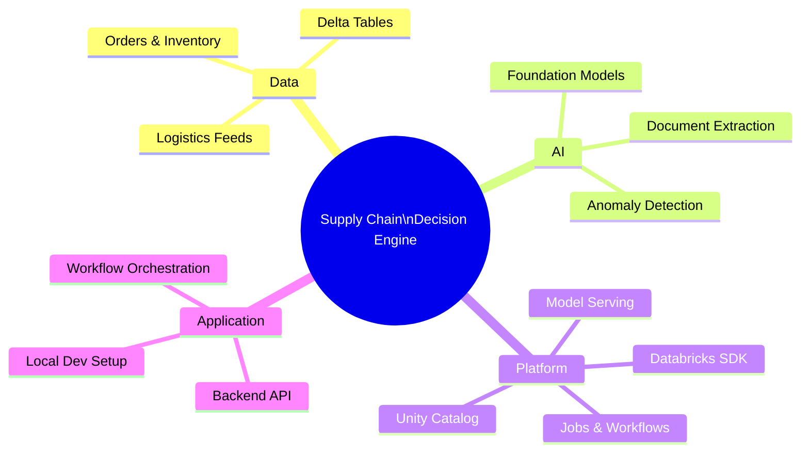
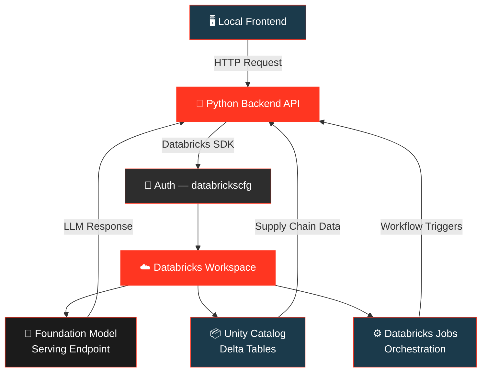
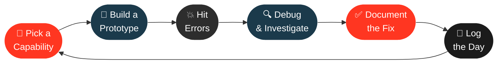
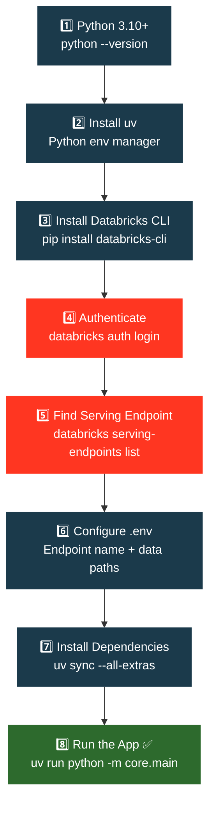
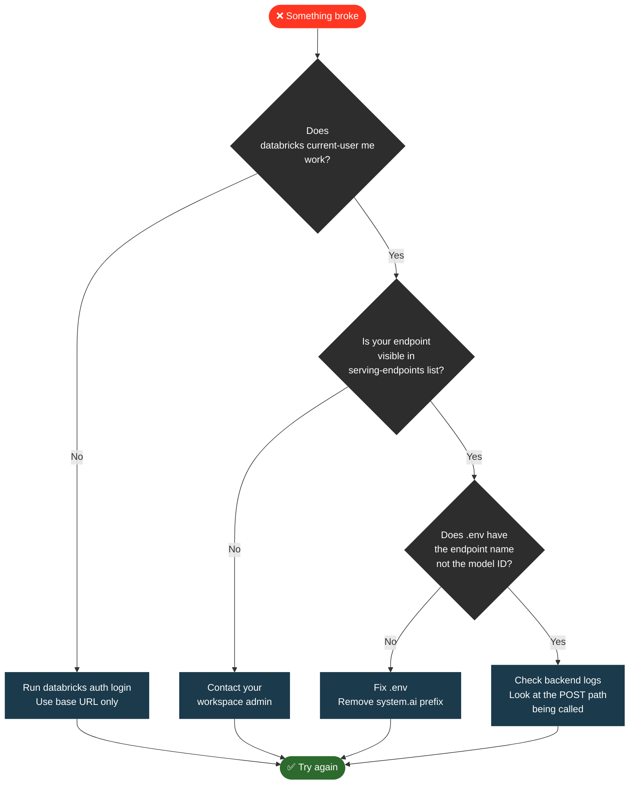

#  &nbsp;Supply Chain × Databricks

**Daily Engineering Experiments — Building Real Systems, Breaking Things, Learning Everything**


---

> *Most Databricks tutorials show clean success paths.*
> *Real projects rarely work that way.*
> **This is the real version.**

---

## 👋 Welcome

This repository is a daily hands-on engineering log.

Every day we pick one piece of Databricks, try to build something real with it, and write down exactly what happened — including the parts that broke, the confusing error messages, and the fixes that actually worked.

The goal is simple: go from a blank Databricks workspace to a fully working **AI-powered Supply Chain Decision Engine**, one experiment at a time.

If you are new to Databricks, or you are trying to build something real and hitting walls — this is for you.

---

## 🧭 What We Are Building



---

## 🏗️ System Architecture



---

## 🎯 What This Is About

We are not just writing code.

We are learning how real Databricks systems are **designed**, **broken**, and **fixed** — and documenting every step so that anyone can follow along or pick up where we left off.

| What We Do | Why It Matters |
|------------|---------------|
| 🔨 Build working prototypes daily | Learn by doing, not just reading |
| 💥 Record every error we hit | Real issues, not sanitised tutorials |
| 🔍 Document the debugging process | Build a practical troubleshooting guide |
| ✅ Write the working solution | Leave a clear path for others to follow |

---

## 🔬 Experiment Areas

```mermaid
flowchart LR
    subgraph PLATFORM["☁️ Databricks Platform"]
        P1[CLI Auth]
        P2[SDK Setup]
        P3[Model Serving]
        P4[Unity Catalog]
        P5[Jobs]
    end

    subgraph DATA["📊 Data Engineering"]
        D1[Ingestion]
        D2[Delta Tables]
        D3[Transformation]
        D4[Batch Processing]
    end

    subgraph AI["🤖 AI & LLM"]
        A1[Foundation Models]
        A2[Document Extraction]
        A3[Anomaly Detection]
        A4[Workflow Automation]
    end

    subgraph APP["🐍 Application Layer"]
        AP1[Backend API]
        AP2[Local Dev]
        AP3[Orchestration]
    end

    PLATFORM --> DATA
    DATA --> AI
    AI --> APP

    style PLATFORM fill:#FF3621,color:#fff,stroke:none
    style DATA fill:#1B3A4B,color:#fff,stroke:none
    style AI fill:#2D2D2D,color:#fff,stroke:none
    style APP fill:#1B1B1B,color:#fff,stroke:none
```



---

## 📅 Daily Experiment Format

Every day follows the same simple structure:



---

## 🗓️ Experiment Log

<details>
<summary><b>📅 Day 1 — Local Setup & First Databricks Connection</b></summary>

<br>

**Goal:** Get the project running locally and make a successful call to a Databricks Foundation Model endpoint.

---

**What we built:**
- Project scaffold with `uv` as the environment manager
- Databricks CLI authentication
- First successful LLM call via the OpenAI-compatible serving endpoint

---

**Errors we hit:**

| Error | What Caused It | How We Fixed It |
|-------|---------------|-----------------|
| `uv not recognized` | Binary not added to PATH after install | Added `~/.local/bin` to system PATH |
| `databricks not recognized` | Python Scripts folder not in PATH | Found Scripts path via `sysconfig` and added to PATH |
| `cannot configure credentials` | Entered full workspace URL with `/browse` path | Used base URL only — no paths, no query strings |
| `ENDPOINT_NOT_FOUND` | Used model identifier instead of endpoint name | Ran `serving-endpoints list` to get correct name |
| `404 Not Found` on API call | Wrong endpoint name flowing into request path | Fixed `.env` value to use serving endpoint name |

---

**Key lesson from Day 1:**

> The serving endpoint name and the model identifier are not the same thing.
> `databricks-claude-sonnet-4-5` ✅
> `system.ai.databricks-claude-sonnet-4-5` ❌
>
> Always verify with `databricks serving-endpoints list` before configuring anything.

</details>

<br>

> 📌 New days are added here as experiments continue.

---

## 🚀 Getting Started From Scratch

If you want to follow along or reproduce any experiment, here is the full setup path.



### Quick Commands

```bash
# 1. Authenticate with Databricks
databricks auth login
# Enter ONLY: https://your-workspace.azuredatabricks.net

# 2. Verify auth worked
databricks current-user me

# 3. Find your serving endpoint name
databricks serving-endpoints list

# 4. Install and run
uv sync --all-extras
uv run python -m core.main --file
```

---

## 🗂️ Repository Structure

```
supply-chain-databricks/
│
├── 📁 core/                  → Application logic & LLM client
├── 📁 workflow/              → LLM workflows & orchestration
├── 📁 data/
│   ├── input/                → Raw supply chain data
│   ├── output/               → Processed results
│   └── orders/               → Order datasets
├── 📁 docs/                  → Daily experiment logs
├── .env                      → Environment config
└── README.md
```

---

## 🐛 When Things Break



---

## 📚 Useful References

| Resource | Link |
|----------|------|
| 📖 Databricks Auth Docs | [docs.databricks.com/en/dev-tools/auth](https://docs.databricks.com/en/dev-tools/auth.html) |
| 🤖 Foundation Model Serving | [Azure Databricks ML Docs](https://learn.microsoft.com/en-us/azure/databricks/machine-learning/foundation-models) |
| 🧠 Supported Models | [Claude Sonnet & Others](https://learn.microsoft.com/en-us/azure/databricks/machine-learning/foundation-models/supported-models) |
| ⚡ uv Package Manager | [docs.astral.sh/uv](https://docs.astral.sh/uv) |
| 🔧 Databricks SDK for Python | [databricks-sdk-py.readthedocs.io](https://databricks-sdk-py.readthedocs.io) |

---

## 🔭 Long-Term Vision

By the end of these experiments we aim to have:

- ✅ A working AI-powered supply chain decision system on Databricks
- ✅ A documented architecture that others can follow and adapt
- ✅ A real-world debugging guide built from actual failures
- ✅ A practical playbook for onboarding engineers to Databricks fast

---

<div align="center">


&nbsp;
**Built daily. Broken often. Fixed always.**
&nbsp;


</div>
